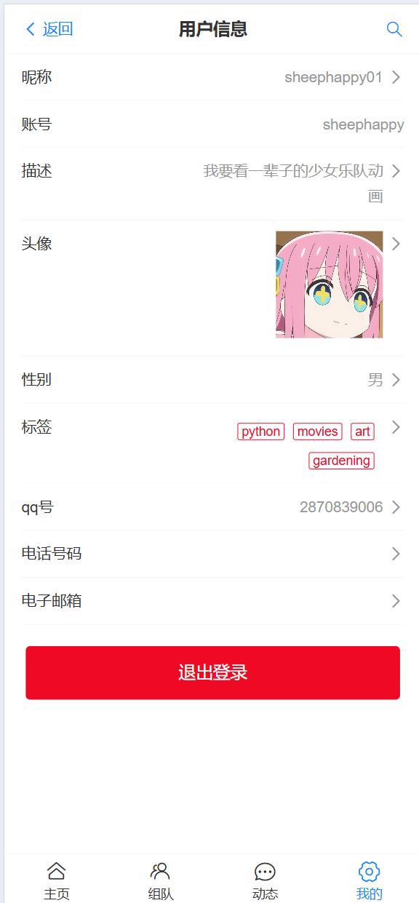
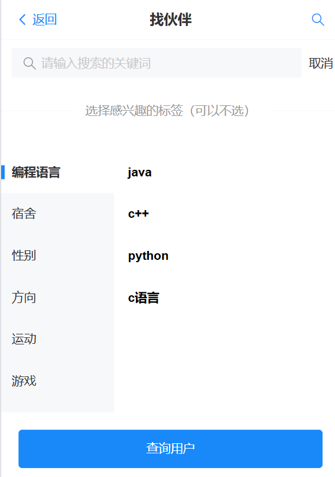
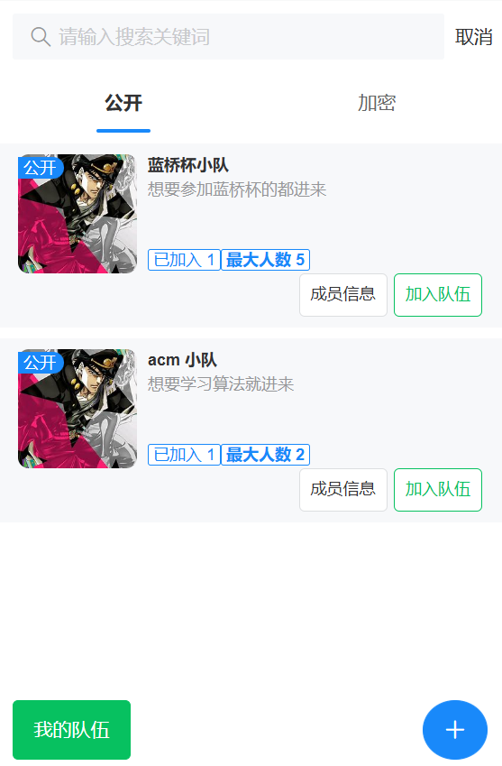
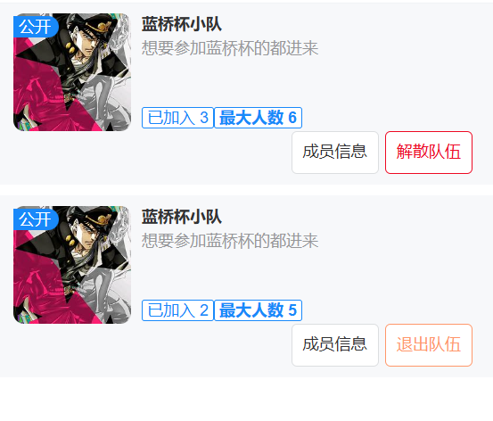
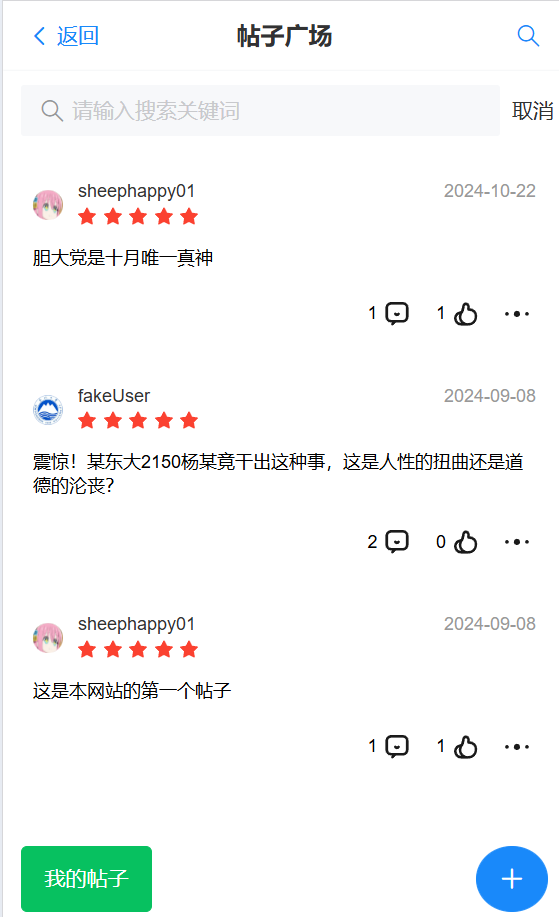

# 伙伴匹配系统
## 项目简介
本项目基于鱼皮星球的伙伴匹配系统，实现了一个在线交友平台，用户可以注册信息，寻找兴趣相近的朋友，也可以与别人组成队伍，共同去完成一件事，也可以发布帖子，发表评论。

## 技术栈
前端使用 vue3 + vite + vant 组件库 和 NutUI 组件库

后端使用 springboot + mysql + redis + RabbitMQ + 阿里云oss

## 功能
### 用户模块
1. 用户注册和登录
2. 上传头像和个人信息
3. 用户可自定义身上的标签，也可以通过标签等关键词寻找兴趣相近的朋友
4. 系统会根据用户身上的标签推荐兴趣爱好相近的朋友

### 组队模块
1. 用户可创建队伍，规定队伍人数上限，队伍可以分为公开队伍和加密队伍
2. 用户可加入队伍，加入成功后可以看到已加入成员的信息
3. 用户可退出队伍，队长可以解散队伍
4. 用户可以根据各种关键词搜索队伍

### 帖子模块
1. 用户可以发布帖子
2. 用户可以给帖子点赞
3. 用户可以在帖子下发表评论

## 项目亮点
1. 系统大量使用 **redis 缓存**，提高数据查询效率，并采取多种方法保证**数据的一致性**。
   - 对于一致性较高的信息，例如用户的个人信息，采用**数据库和缓存双写**的办法维护数据的一致性；
   - 对于用户推荐的缓存数据，考虑到推荐算法是一个非常耗时的操作，采用**消息队列来异步更新**推荐用户的信息。
   - 对于点赞这样更改频繁的数据，采用的**定时写入数据库**方法保证数据的一致性。

2. 对于高并发的业务功能，采取了多种**并发控制**方法。

   - 为了避免高并发下的重复入队，入队人数超过最大人数问题，采用 **redisson 分布式锁**解决

   - 为了避免高并发下点赞异常，采用 redis 配合**lua 脚本**实现操作的原子性。

3. 对于数据库和 redis 的一些复杂操作，采用**批量处理**来提高效率。

## 项目扩展点

1.  实现多种登录方式，例如，手机验证码登录、微信登录等
2. 实现在线聊天功能，一个队伍的成员可以进行聊天。
3. 完善评论和评论回复的功能